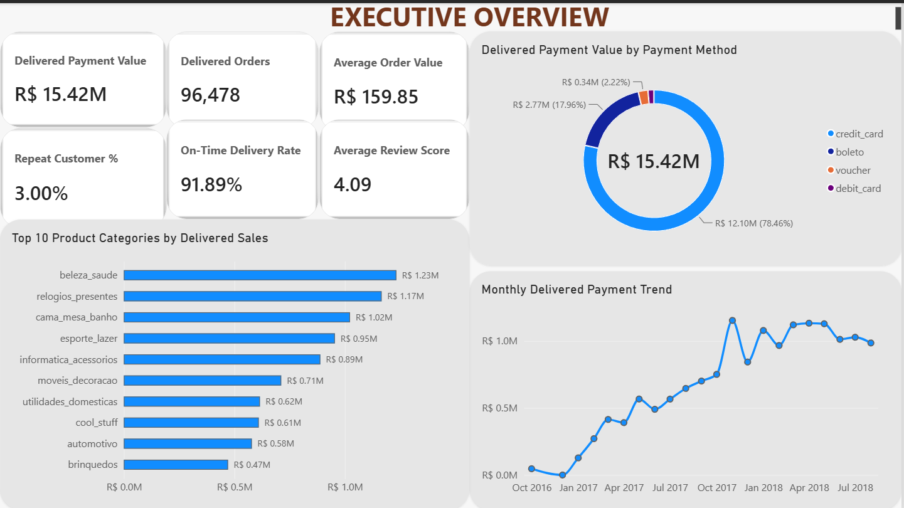
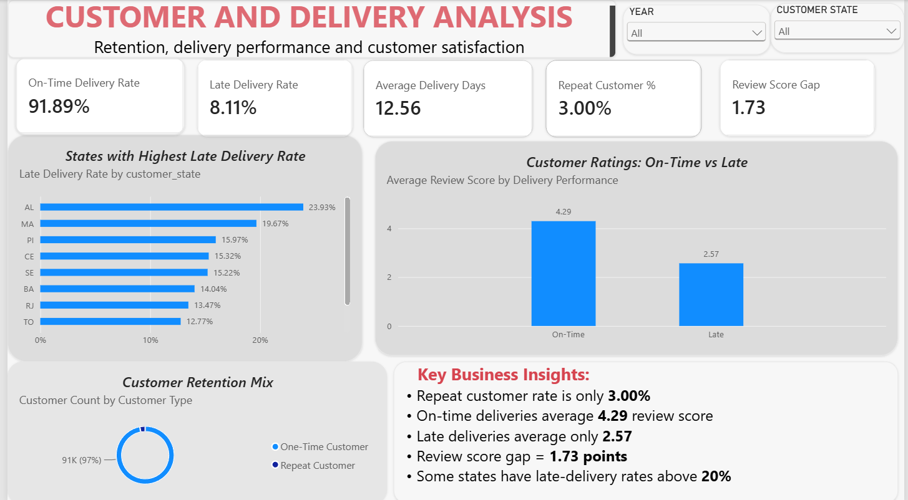
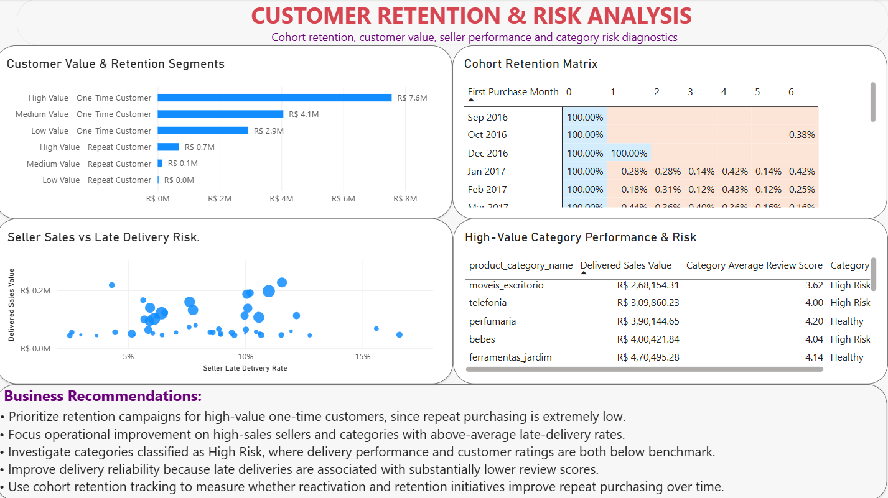

# E-Commerce Sales & Customer Analytics

## Project Overview

This project analyzes the Brazilian Olist e-commerce dataset to identify key business trends across sales, customers, delivery performance, product categories, sellers, payments, and customer satisfaction.

The project follows an end-to-end Data Analyst workflow using **SQL, Python, and Power BI**, starting from data validation and exploratory analysis through business intelligence dashboards and actionable recommendations.

---

## Business Objectives

The analysis focuses on answering key business questions such as:

- How much revenue is generated from delivered orders?
- Which product categories generate the highest sales?
- How strong is customer retention?
- Which customer segments contribute the most value?
- How does delivery performance affect customer ratings?
- Which sellers and categories present operational risk?
- How does customer retention change across acquisition cohorts?

---

## Tools & Technologies

- **SQL:** PostgreSQL / pgAdmin
- **Python:** Pandas, NumPy
- **Power BI:** Data modeling, DAX, interactive dashboards
- **Jupyter Notebook**
- **Git & GitHub**

---

## Key Business KPIs

| KPI | Result |
|---|---:|
| Delivered Payment Value | R$15.42M |
| Delivered Orders | 96,478 |
| Average Order Value | R$159.85 |
| Repeat Customer Rate | 3.00% |
| On-Time Delivery Rate | 91.89% |
| Late Delivery Rate | 8.11% |
| Average Delivery Time | 12.56 days |
| Average Review Score | 4.09 |
| Review Score Gap | 1.73 points |

---

## Key Insights

### 1. Customer Retention Is the Largest Business Opportunity

Approximately **97% of customers are one-time customers**, indicating extremely low repeat purchasing.

High-value one-time customers represent approximately **18.36% of customers but contribute around 49.06% of delivered customer spend**.

This creates a major opportunity for targeted retention and reactivation campaigns.

### 2. Delivery Performance Is Strongly Associated With Customer Satisfaction

On-time deliveries receive an average review score of approximately **4.29**, while late deliveries average only **2.57**.

The resulting **1.73-point review-score gap** shows that poor delivery performance is strongly associated with lower customer satisfaction.

### 3. Certain States Have Significant Delivery Risk

Although the overall late-delivery rate is approximately **8.11%**, some states experience substantially higher late-delivery rates.

These regions should be prioritized for logistics and fulfillment investigation.

### 4. Seller Performance Requires Risk-Based Monitoring

Seller-level analysis identifies sellers generating meaningful sales while also experiencing elevated late-delivery rates.

This allows the business to prioritize high-value sellers that require operational attention instead of treating all sellers equally.

### 5. Product Categories Have Different Operational Risk Profiles

High-revenue categories were evaluated using:

- Delivered sales
- Eligible delivered orders
- Late-delivery rate
- Average review score
- Risk classification

Categories were classified as **Healthy, Delivery Risk, Review Risk, or High Risk** to identify where operational improvements would have the greatest business impact.

### 6. Cohort Retention Remains Very Low

Monthly cohort analysis shows that customer return rates decline sharply after the initial purchase month.

This supports the broader finding that customer acquisition is strong but customer retention is weak.

---

## Dashboard Pages

### 1. Executive Overview



Provides a high-level view of:

- Delivered payment value
- Delivered orders
- Average order value
- Repeat customer rate
- On-time delivery performance
- Customer review score
- Product category sales
- Payment-method distribution
- Monthly payment trends

---

### 2. Customer & Delivery Analysis



Focuses on:

- On-time vs late delivery performance
- Average delivery time
- Repeat customer rate
- Review-score gap
- States with high late-delivery rates
- Customer retention mix
- Customer ratings for on-time vs late deliveries

---

### 3. Customer Retention & Risk



Provides deeper diagnostic analysis through:

- Customer value and retention segmentation
- Cohort retention analysis
- Seller sales vs late-delivery risk
- Category performance and risk classification
- Business recommendations

---

## Business Recommendations

1. Prioritize retention campaigns for **high-value one-time customers**.
2. Investigate high-sales sellers with above-average late-delivery rates.
3. Prioritize high-value product categories classified as **High Risk**.
4. Improve delivery reliability in states with unusually high late-delivery rates.
5. Use customer review scores as an operational quality indicator.
6. Track cohort retention over time to measure the impact of customer reactivation initiatives.

---

## Project Structure

```text
E-Commerce-Sales-Customer-Analytics/
│
├── README.md
├── 1_data/
├── 2_documentation/
├── 3_SQL/
├── 4_python/
├── 5_power bi/
├── 6_Screenshots/
└── 7_outputs/

## Author

Deepak S

Data Analyst Portfolio Project